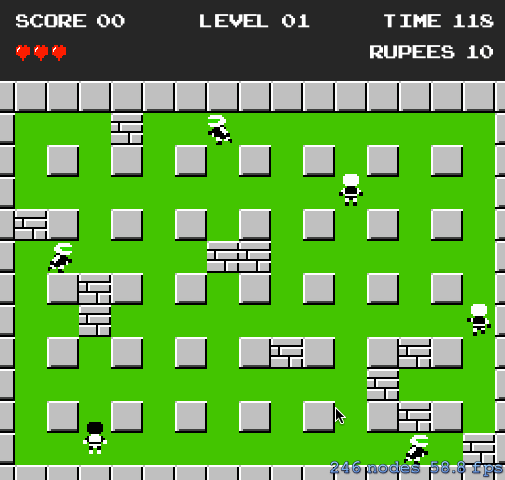

Daft-Man
========
A fork of Ryan Ashcraft's DaftMan rewritten in Objective-C.

Ryan's [DaftMan on GitHub](http://github.com/ryanashcraft/DaftMan) is slightly modified (foe's have AI), but is otherwise the same. This does not have AI (yet).

## Credit
I don't claim ownership of any of the resources, i.e. sprites, sounds, or music files, included herein.

The idea of DaftMan is entirely [Ryan's](http://github.com/ryanashcraft).
